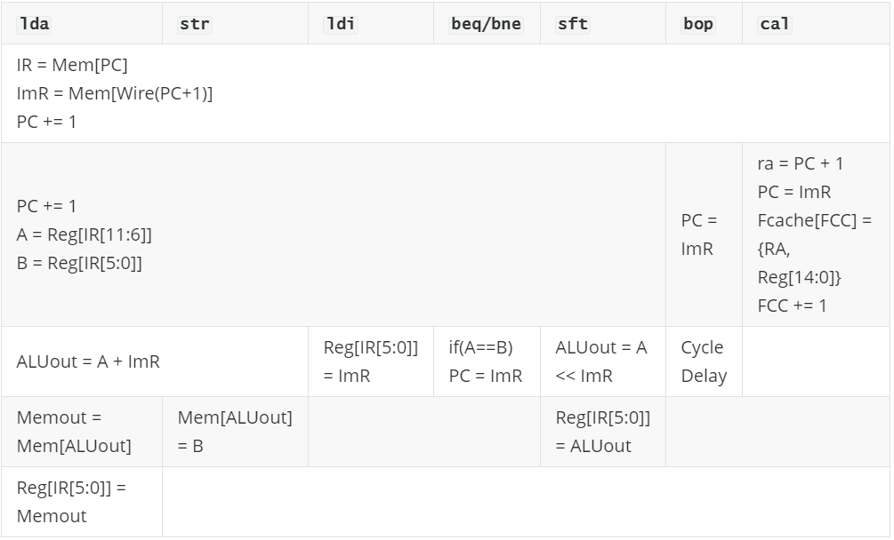
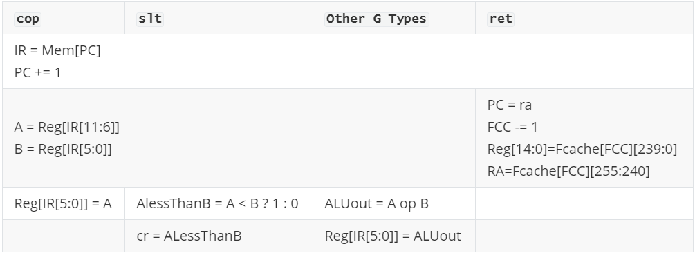
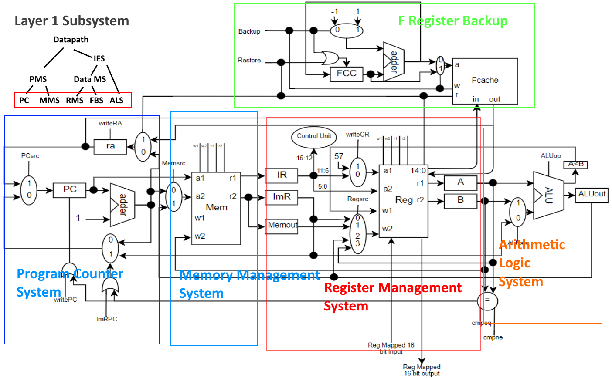
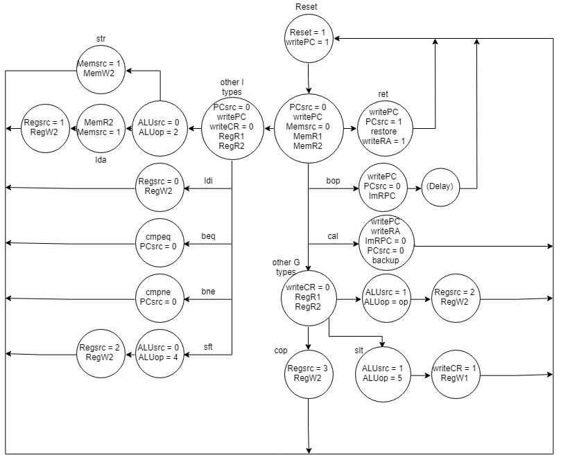

# BAEJ

BAEJ is a Reduced Instruction Set Computer Architecture which implements a load store architecture

## Registers

|Registers | Address | Use |
| --- | --- | --- |
|.f0 - .f14|0-14|General purpose 'function registers' where data is not lost after a function call|
|.ip|15|Register file mapped 16 bit input port|
|.op | 16 | Register file mapped 16 bit output port |
|.t0 - .t27|17-44|General purpose 'temporary registers' where data may be overwritten during a function call|
|.a0 - .a5 |45-50|Argument registers for function calls|
|.m0 - .m5 |51-56|Accumulator registers on which default mathematical operations are committed|
|.cr       |57|Compiler register (used for slt)|
|.v0 - .v3 |58-61|Return value registers from a function call|
|.sp       |62|Stack pointer register|
|.z0       |63|Register always holding the value 0|

### Function Registers (.f0 - .f14)
Function registers serve as registers which can be safely used during any function without backing up on a stack. In order to reduce the requirements imposed on the user, backing up and restoring the first 15 registers in our register file (.f0- .f14) happens automatically to an internal memory unit, called the Fcache, upon function calls and returns (i.e. cal and ret). For the user to make a function call, they need to move all of their values that they expect to be saved into the F registers. Upon return from the function call, the user's values will be safely returned to the F registers via the Fcache. 

## Instruction Formats

**I Types**	

|<sup>15</sup> OPCODE <sup>12</sup>|<sup>11</sup>    RS    <sup>6</sup>|<sup>5</sup>    RD    <sup>0</sup>|	(1<sup>st</sup> word)

|<sup>15</sup>                  IMMEDIATE                   <sup>0</sup>|	(2<sup>nd</sup> word)

>I type instructions use the format above. They are multi-word instructions with the first word consisting of a 4 bit op code followed by two 6 bit register addresses. The second word will be the 16 bit immediate value used in the instruction.

**G Types**	

|<sup>15</sup> OPCODE <sup>12</sup>|<sup>11</sup>    RS    <sup>6</sup>|<sup>5</sup>    RD    <sup>0</sup>|	(1<sup>st</sup> word)

> G type instructions use the same format as I type as described above. They do not, however, have an immediate, and only have one word in their machine code format.

## Instructions

**IM stands for immediate*

**Optional argument of .rm specifies an accumulator register to operate on (defaults to .m0)*

|Instr|Type|OP|Usage|Description|Rtl|
|-----------|----|--|-----|-----------|---|
|```lda```|I|0000|```lda .rs[IM] .rd```|Loads a value from memory to rd|```rd = Mem[rs+IM]```|
|```ldi```|I|0001|```ldi .rd IM```|Loads an immediate to rd|```rd = IM```|
|```str```|I|0010|```str .rs[IM] .rd```|Stores value in rd to memory|```Mem[rs+IM] = rd```|
|```bop```|I|0011|```bop IM```|Changes pc to immediate|```pc = IM```|
|```cal```|I|0100|```cal IM```|Changes pc to immediate and sets a return address; backs up f registers (.f0-.f14)|```ra = pc+2```<br>```pc = IM```<br>```FCC += 1```|
|```beq```|I|0101|```beq .rs .rd IM```|Changes pc to immediate if rs and rd are equal|```if rs==rd```<br>&nbsp;&nbsp;&nbsp;&nbsp;&nbsp;&nbsp;```pc=IM;```|
|```bne```|I|0110|```bne .rs .rd IM```|Changes pc to immediate if rs and rd aren't equal|```if rs!=rd```<br>&nbsp;&nbsp;&nbsp;&nbsp;&nbsp;&nbsp;```pc = IM;```|
|```sft```|I|0111|```sft .rs .rd IM```|Shifts value in rs to rd by immediate. Positive shifts left, negative shifts right|```rd=rs<<IM```|
|```cop```|G|1000|```cop .rs .rd```|Copies the value of rs to rd while retaining the original value of rs|```rd = rs```|
|```slt```|G|1010|```slt .rs .rd```|Sets cr to 1 if rs is less than rd; 0 otherwise|```cr=rs<rd?1:0```|
|```ret```|G|1011|```ret```|Sets pc to the value in ra; restores f registers (.f0-.f14)|```pc=ra```<br>```FCC-=1```|
|```add```|G|1100|```add .rs [.rm]```|Adds rs into the accumulator*|``` [rm] += rs```|
|```sub```|G|1101|```sub .rs [.rm]```|Subtracts rs from the accumulator*|```[rm] -= rs```|
|```and```|G|1110|```and .rs [.rm]```|Ands rs with the accumulator*|```[rm] &= rs```|
|```orr```|G|1111|```orr .rs [.rm]```|Ors rs with the accumulator*|```[rm] |= rs```|


## Function Calls

When calling a function, the programmer places the arguments in registers .a0 - .a5 and uses the command cal (i.e.  ```cal myFunc```). The instruction will jump the program counter to the address of the function while also putting the incremented previous program counter value into the return address register (.ra). The function will then return (ret) to the address in the ra register. The programmer can expect their data in f registers to be retained; they should not expect data in any other register to be retained. After a function returns, returned values will be in the v registers. When writing a function, the user is responsible for returning from the function using ```ret```.

## Examples


### Common Assembly/Machine Language Fragments
#### Loading an address into a register (.f1)
##### BAEJ Code
```assembly
ldi	.f0	addr
lda	.f0[0] .f1		
```
##### Machine Code Translation (assuming the value stored in addr is 280)
```
0x00			0001 000000 000000
0x01			0000 000100 011000
0x02 			0000 000000 000001
0x03			0000 000000 000000
```


#### Sum Values from x (.a0) to y (.a1) assuming x < y
##### BAEJ Code
```assembly
		cop	.a0 .m0
		cop .a0 .m1
		ldi	.f0 1
loop:	add .f0 .m1
		add	.m1
		slt	.m1 .a1
		bne	.z0 .cr loop
```

##### Machine Code Translation (Assuming the address of loop is 0x8)
```
0x00			1000 101101 110011
0x01			1000 101101 110100
0x02	 		0001 000000 000000
0x03			0000 000000 000001
0x04	loop:	1100 000000 110100
0x05			1100 110100 110011
0x06			1010 110100 101110
0x07			0110 111111 111001
0x08			0000 000000 000100
```


### Modulus
##### BAEJ Code
```assembly
loop:	add	.a1
		slt	.a0	.m0
		bne	.z0	.cr	loop
		sub	.a1
		cop	.a0	.m1
		sub	.m0	.m1
```

##### Machine Language Translation (Assuming the address of loop is at 0x00)
```
0x00	loop:	1100 101110 110011
0x01			1010 101101 110011
0x02			0110 111111 111001
0x03			0000 000000 000000
0x04			1101 101110 110011
0x05			1000 101101 110011
0x06			1101 110011 110100
```


### Euclid's Algorithm
#### C Code
```c
// Find m that is relatively prime to n.
int
relPrime(int n)
{
   int m;

   m = 2;

   while (gcd(n, m) != 1) {  // n is the input from the outside world
     m = m + 1;
   }

   return m;
}

// The following method determines the Greatest Common Divisor of a and b
// using Euclid's algorithm.
int
gcd(int a, int b)
{
  if (a == 0) {
    return b;
  }

  while (b != 0) {
    if (a > b) {
      a = a - b;
    } else {
      b = b - a;
    }
  }

  return a;
}
```
#### BAEJ and Machine Code Translation
```
relP:	0x00	0001 000000 010000	ldi .op 2
        0x01	0000 000000 000010	
        0x02	0001 000000 000001	ldi .f1 1
        0x03	0000 000000 000001	
loop:	0x04	1000 001111 101101	cop .ip .a0
        0x05	1000 010000 101110	cop .op .a1
        0x06	0100 000000 000000	cal gcd
        0x07	0000 000000 001111	
        0x08	0101 111010 000001	beq .v0 .f1 end
        0x09	0000 000000 001101	
        0x0A	1100 000001 010000	add .f1 .op
        0x0B	0011 000000 000000	bop loop
        0x0C	0000 000000 000100	
end:	0x0D	0011 000000 000000	bop 32
        0x0E	0000 000000 100000	
gcd:	0x0F	0110 101101 111111	bne .a0 .z0 cont
        0x10	0000 000000 010011	
        0x11	1000 101110 111010	cop .a1 .v0
        0x12	1011 000000 000000	ret
cont:	0x13	0101 101110 101101	beq .a1 .a0 done
        0x14	0000 000000 011110	
        0x15	1010 101110 101101	slt .a1 .a0
        0x16	0101 111001 111111	beq .cr .z0 else
        0x17	0000 000000 011011	
        0x18	1101 101110 101101	sub .a1 .a0
        0x19	0011 000000 000000	bop cont
        0x1A	0000 000000 010011	
else:	0x1B	1101 101101 101110	sub .a0 .a1
        0x1C	0011 000000 000000	bop cont
        0x1D	0000 000000 010011	
done:	0x1E	1000 101101 111010	cop .a0 .v0
        0x1F	1011 000000 000000	ret
```
## RTL

#### I Types



<table>
    <thead>
    	<th><code>lda</code></th>
    	<th><code>str</code></th>
    	<th><code>ldi</code></th>
    	<th><code>beq/bne</code></th>
    	<th><code>sft</code></th>
    	<th><code>bop</code></th>
    	<th><code>cal</code></th>
    </thead>
    <tbody>
        <tr>
            <td colspan=7>IR = Mem[PC]<br>ImR = Mem[Wire(PC+1)]<br>PC += 1</td>
        </tr>
        <tr>
            <td colspan=5>PC += 1<br>A = Reg[IR[11:6]]<br>B = Reg[IR[5:0]]</td>
            <td>PC = ImR</td>
            <td>ra = PC + 1<br>PC = ImR<br>Fcache[FCC] = {RA, Reg[14:0]}<br>FCC += 1</td>
        </tr>
        <tr>
            <td colspan=2>ALUout = A + ImR</td>
            <td>Reg[IR[5:0]] = ImR</td>
            <td>if(A==B)<br>PC = ImR</td>
            <td>ALUout = A &lt;&lt; ImR</td>
            <td>Cycle Delay</td>
            <td></td>
        </tr>
        <tr>
            <td>Memout = Mem[ALUout]</td>
            <td>Mem[ALUout] = B</td>
            <td colspan=2></td>
            <td>Reg[IR[5:0]] = ALUout</td>
            <td colspan=2></td>
        </tr>
        <tr>
        	<td>Reg[IR[5:0]] = Memout</td>
        	<td colspan=6></td>
        </tr>
    </tbody>
</table>


#### G Types



<table>
    <thead>
    	<th><code>cop</code></th>
    	<th><code>slt</code></th>
    	<th><code>Other G Types</code></th>
    	<th><code>ret</code></th>
    </thead>
    <tbody>
        <tr>
            <td colspan=4>IR = Mem[PC]<br>PC += 1</td>
        </tr>
        <tr>
            <td colspan=3>A = Reg[IR[11:6]]<br>B = Reg[IR[5:0]]</td>
            <td>PC = ra<br>FCC -= 1<br>Reg[14:0]=Fcache[FCC][239:0]<br>RA=Fcache[FCC][255:240]</td>
        </tr>
        <tr>
            <td>Reg[IR[5:0]] = A</td>
            <td>AlessThanB = A < B ? 1 : 0</td>
        	<td>ALUout = A op B</td>
            <td></td>
        </tr>
        <tr>
        	<td></td>
            <td>cr = ALessThanB</td>
            <td>Reg[IR[5:0]] = ALUout</td>
            <td></td>
        </tr>
    </tbody>
</table>


### Testing the RTL
#### Code Tracing
In order to verify the RTL, a code tracing exercise was used. The RTL was verified by tracing the logic and values through the RTL as if a Java program were executing it. If it gave unexpected results, the RTL was modified accordingly.

#### Simulation

Java will be used to simulate the RTL, such that variables will represent registers, a Java Map will represent the register and storage files (with addresses mapped to their respective values), and multiplication will represent bit shifting. For example, an implementation of lda, according to our RTL, will be implemented using the following Java code.

```
 int IR;
 int IMR;
 int PC;
 int ALUout;
 int Memout;
 int A;
 int B;
 
 HashMap<Integer, Integer> Mem;
 HashMap<Integer, Integer> Reg;
 
 public void lda () {
     IR = Mem.get(PC);
     IMR = Mem.get(PC + 1);
     PC += 1;
     // -----------------------
     PC += 1;
     A = Reg.get(IR >> 6 & 0b00111111); // IR[11:6];
     B = Reg.get(IR >> 0 & 0b00111111); // IR[5:0];
     // -----------------------
     ALUout = A + IMR;
     // -----------------------
     Memout = Mem.get(ALUout);
     Reg.put(Memout, Reg.get(IR & 0b00111111)); // IR[5:0];
 }
```

A similar implementation was done for other instructions. 

## Hardware Components

#### Adder

| Items                       | Descriptions                                                 |
| --------------------------- | ------------------------------------------------------------ |
| **Inputs**                  | A[15:0], B[15:0]                                             |
| **Outputs**                 | R[15:0]                                                      |
| **Control Signals**         | None                                                         |
| **Functionality**           | Outputs A+B onto R                                           |
| **Hardware Implementation** | In Verilog, assign A+B to the output R                       |
| **Unit Tests**              | Input all permutations of two integers from -20 to 20 and verifies the output is correct |

#### Single bit Multiplexer

| Items                       | Descriptions                                                 |
| --------------------------- | ------------------------------------------------------------ |
| **Inputs**                  | A[15:0], B[15:0]                                             |
| **Outputs**                 | R[15:0]                                                      |
| **Control Signals**         | S                                                            |
| **Functionality**           | Will constantly put the value of A or B specified by the S control bit onto R |
| **Hardware Implementation** | Verilog switch case, which assigns A to R given a low signal for S, otherwise, assigns B to R |
| **Unit Tests**              | Put all permutations of -10 to 10 on A and B and attempts to select A then B while testing that the correct output is on R |

#### Two bit Multiplexer

| Items                       | Descriptions                                                 |
| --------------------------- | ------------------------------------------------------------ |
| **Inputs**                  | A[15:0], B[15:0], C[15:0], D[15:0]                           |
| **Outputs**                 | R[15:0]                                                      |
| **Control Signals**         | S[1:0]                                                       |
| **Functionality**           | Will constantly put the value of A, B, C, D specified by the S control bit onto R |
| **Hardware Implementation** | Verilog switch case, which given 0, 1, 2, or 3, assigns A, B, C, or D to R respectively. |
| **Unit Tests**              | Put all permutations of 4 numbers each from -10 to 10 on A, B, C, and D and attempts to select A, then B, then C, and finally D while testing that the correct output is on R |

#### ALU

| Items                       | Descriptions                                                 | ALU op | Operation     |
| --------------------------- | ------------------------------------------------------------ | ------ | ------------- |
| **Inputs**                  | A[15:0], B[15:0]                                             | 000    | AND           |
| **Outputs**                 | A<B (AltB), R[15:0]                                          | 001    | OR            |
| **Control Signals**         | ALUop[2:0]                                                   | 010    | ADD           |
| **Functionality**           | Takes the mathematical operation specified by Operation and preforms in on operand A and B, puts result on A<B or R depending on operation | 011    | SUBTRACT      |
| **Hardware Implementation** | Verilog switch case that assigns the result of the appropriate operation on A and B to R based off of the op code | 100    | SHIFT         |
| **Unit Tests**              | A loop in Verilog for each op code which inputs all permutations of two inputs from -10 to 10 and verifies with the output that the operation was performed correctly on the inputs | 101    | SET LESS THAN |

#### Comparator

| Items                       | Descriptions                                                 |
| --------------------------- | ------------------------------------------------------------ |
| **Inputs**                  | A[15:0], B[15:0]                                             |
| **Outputs**                 | R                                                            |
| **Control Signals**         | cmpeq, cmpne                                                 |
| **Functionality**           | Whenever the cmpeq signal is high, outputs a 1 on R if A == B, when cmpne is high, outputs a 1 on R if A != B, otherwise a 0 is output on R. |
| **Hardware Implementation** | Verilog module which assigns A==B if cmpeq is high, A!=B if cmpne is high, otherwise 0 to R |
| **Unit Tests**              | A loop in verilog which inputs a range of 0-32 on to A and B and checks that the output for each control signal is correct |

#### Fcache

| Items                       | Descriptions                                                 |
| --------------------------- | ------------------------------------------------------------ |
| **Inputs**                  | wData[255:0], addr[15:0], clk                                |
| **Outputs**                 | rData[255:0]                                                 |
| **Control Signals**         | write                                                        |
| **Functionality**           | When the Write signal is high, takes the value on wData and stores it in address addr. The Fcache always puts the value at addr on rData. |
| **Hardware Implementation** | Static storage implemented using a register-file like structure. Use the verilog register file provided on the course website, altering it to 256 bit words. In verilog, write a module which wraps the register file to allow for a bus serving as both input and output. |
| **Unit Tests**              | A loop in verilog which goes through a large range of addresses and writes many different 256 bit values while reading them each iteration to ensure they are correct. |

#### Register File

| Items                       | Descriptions                                                 |
| --------------------------- | ------------------------------------------------------------ |
| **Inputs**                  | a1[15:0], a2[15:0], w1[15:0], w2[15:0], fcIn[239:0], clk, ioIn[15:0] |
| **Outputs**                 | r1[15:0], r2[15:0], fcOut[239:0], ioOut[15:0]                |
| **Control Signals**         | RegW1, RegW2, RegR1, RegR2, restore                          |
| **Functionality**           | With a write control signal high (RegW1 or RegW2), takes the respective value (w1 or w2) and stores it in the register specified by the respective address (a1 or a2). With a read signal high (RegR1 or RegR2), takes the value at the respective address and puts it onto the respective output (r1 or r2). The register file always puts the values in registers 0 to 14 on fcOut. When restore is high, stores the values on fCin into registers 0 to 14. |
| **Hardware Implementation** | Static storage implemented using a series of 64 registers. Use the verilog register file provided on the course website and alter as needed to enable dual port functionality (Multiple inputs and outputs). |
| **Unit Tests**              | A loop in verilog which goes through a large range of addresses and writes many 16 bit values while reading them each iteration to ensure they are correct. |

#### Memory Unit

| Items                       | Descriptions                                                 |
| --------------------------- | ------------------------------------------------------------ |
| **Inputs**                  | A1[15:0], A2[15:0], W1[15:0], W2[15:0]                       |
| **Outputs**                 | R1[15:0], R2[15:0]                                           |
| **Control Signals**         | MemW1, MemW2, MemR1, MemR2                                   |
| **Functionality**           | With a write signal high (MemW1 or MemW2), takes the respective value (W1 or W2) and stores it in the respective address (A1 or A2). With a Read signal high (MemR1 or MemR2), takes the value at the respective address and puts it onto the respective output (R1 or R2). |
| **Hardware Implementation** | Implemented in verilog using the Memory unit provided on the course website, altering it as needed to enable dual port functionality (Multiple inputs and outputs). |
| **Unit Tests**              | A loop in verilog which goes through a large range of addresses and writes many 16 bit values while reading them each iteration to ensure they are correct. |


## Integrating and Testing the Components

### Integration Plan

| Subsystem                        | Composition                                                  |
| -------------------------------- | ------------------------------------------------------------ |
| **Program Counting System**      | Register (x2), Single bit Multiplexer (x2), Adder, Or-gate   |
| **Memory Management System**     | Memory Unit, Single bit Multiplexer, Register (x3)           |
| **Register Management System**   | Register File, Single bit Multiplexer, Two bit Multiplexer, Register (x2) |
| **Fcache Backup System**         | Fcache, Single bit Multiplexer (x2), Adder, Register, Or-gate |
| **Arithmetic and Logic System**  | ALU, Single bit Multiplexer, Register (x2)                   |
| **Program Management System**    | Program Counting System, Memory Management System            |
| **Data Management System**       | Register Management System, Fcache Backup System             |
| **Instruction Execution System** | Data Management System, Arithmetic and Logic System          |
| **Datapath**                     | Program Management System, Instruction Execution System      |

### Datapath Block Diagram with Subsystems



### Test Plans

| Subsystem                              | Test Plan                                                    |
| -------------------------------------- | ------------------------------------------------------------ |
| **Program Counting System** (PCS)      | Run the system through a few clock cycles to test that it correctly increments by one each time. Also ensure that we can write pc + 1 to ra. Once this is verified, inject addresses from a set of addresses, and from register ra, to test branching functionality. |
| **Memory Management System **(MMS)     | Input values into a sequential block of memory then read from the same block, verifying that each read gives the output registers the correct values that were written. |
| **Register Management System** (RMS)   | Input values into registers from all permutations of the input ports, then read from registers with known values verifying that each read gives the output registers the correct values. Input values on fcIn and check restore/backup functionality. Input values on ioIn and check input/output functionality. Compare register values with comparator and verify result. |
| **Fcache Backup System** (FBS)         | Conduct multiple backups of known values to a sequential block in the Fcache memory, then using multiple restores, read back the same block verifying the output is what was written. |
| **Arithmetic and Logic System** (ALS)  | Conduct all possible ALU operations on a wide range of input values using all possible input methods (i.e. different ALUsrc signals to the multiplexer). Test each operation for correct output values. |
| **Program Management System** (PMS)    | Hard-code values into a sequential block of memory then allow the program counter to increment through memory and verify that the correct values which were written to memory are written to the output registers. |
| **Data Management System** (DMS)       | Repeatedly write values to registers 0 - 14 using many permutations of input methods. Each time all 15 registers are filled, send a backup control signal. Do this many times then conduct the same number of restores, ensuring values are correct along the way. |
| **Instruction Execution System** (IES) | Give this system the control signals needed for basic instructions which don't require memory such as arithmetic operations and moving values around in the register file. Include many different input values with each set of control signals and verify expected output. |
| **Datapath**                           | SEE SYSTEM TESTING                                           |

### System Testing
The following algorithms will be coded into memory.

| Test Algorithm        | Expected Result                                   |
| --------------------- | ------------------------------------------------- |
| add (int a)           | 64 + a                                            |
| sub (int a)           | 64 - a                                            |
| and (int a)           | 64 & a                                            |
| orr (int a)           | 64 or a                                           |
| slt (int a)           | (a < 64) ? 1:0                                    |
| sft (int a)           | a << 2 ; a >> 2                                   |
| summation (int a)     | Sum of all integers between 0 and a               |
| memory (int a)        | "a" stored in memory and then retrieved to output |
| relativePrime (int a) | The first relative prime number of a              |


## Control

### Control Unit

| Items                       | Descriptions                                                 |
| --------------------------- | ------------------------------------------------------------ |
| **Inputs**                  | op[3:0], clk                                                 |
| **Outputs**                 | B[23:0] (22 unique control signals, 24 bits in all)          |
| **Control Signals**         | Reset                                                        |
| **Functionality**           | Given an op-code (or address), the unit outputs the necessary control signals to the corresponding instruction and state |
| **Hardware Implementation** | Implemented as a state machine in Verilog that sets the current state and control signals depending on the op code |
| **Unit Tests**              | A loop in Verilog which sets every permutation of the 4-bit op-code then verifies the expected output control signals. |

### Control Signals

|Signal Name|Bits|Effect when deasserted (0)|Effect when asserted (1)|
| --- | --- | --- |---|
|PCsrc|1|PC is set to default value (PC+1) or ImR|PC is set to the value of RA|
|writePC|1|Nothing|PC gets the value chosen by PCsrc mux |
|writeRA|1|Nothing|RA gets the value of PC + 1|
|ImRPC|1|ImRPC mux chooses PC+1|ImRPC mux chooses immediate value (only when comparator is enabled and outputs a high signal)|
|Memsrc|1|Address 1 in Mem is pulled from PC + 1|Address 1 in Mem is pulled from ALUout|
|MemW1|1|Nothing|The value at port w1 is written to the address specified by a1|
|MemW2|1|Nothing|The value at port w2 is written to the address specified by a2|
|MemR1|1|Nothing|The value at the address specified by a1 is read to port r1|
|MemR2|1|Nothing|The value at the address specified by a2 is read to port r2|
|writeCR|1|The reg number specified at reg file port a1 is IR[11:6] (default)|The reg number specified at reg file port a1 is 57 (for compiler register)|
|Regsrc|2|0: Value at reg file port w2 comes from ImR; 1: Value at port w2 comes from Memout|2: Value at port w2 comes from ALUout; 3: Value at port w2 comes from reg A|
|backup|1|Nothing|Registers 14:0 (240 bits) from the reg file and RA (16 bits) are written to the Fcache at the address specified by "a"; FCC is incremented by 1|
|restore|1|Nothing|The 256 bit value at the address specified by "a" in the Fcache is written to registers 14:0 in the reg file and RA; FCC is decremented by 1|
|RegW1|1|Nothing|The value at port w1 is written to the reg address specified by a1|
|RegW2|1|Nothing|The value at port w2 is written to the reg address specified by a2|
|RegR1|1|Nothing|The value at the reg address specified by a1 is read to port r1|
|RegR2|1|Nothing|The value at the reg address specified by a2 is read to port r2|
|ALUsrc|1|2nd ALU operand comes from ImR|2nd ALU operand comes from reg B|
|ALUop|3|SEE ALU IN COMPONENTS|SEE ALU IN COMPONENTS|
|cmpeq|1|Nothing|The result of the comparison A=B is sent to the ImRPC mux|
|cmpne|1|Nothing|The result of the comparison A!=B is sent to the ImRPC mux|

### FSM Diagram


